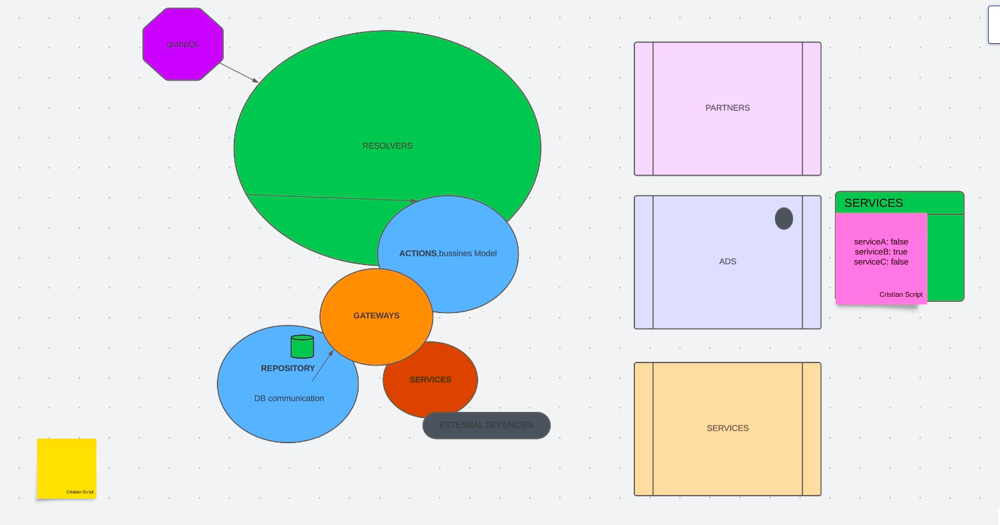
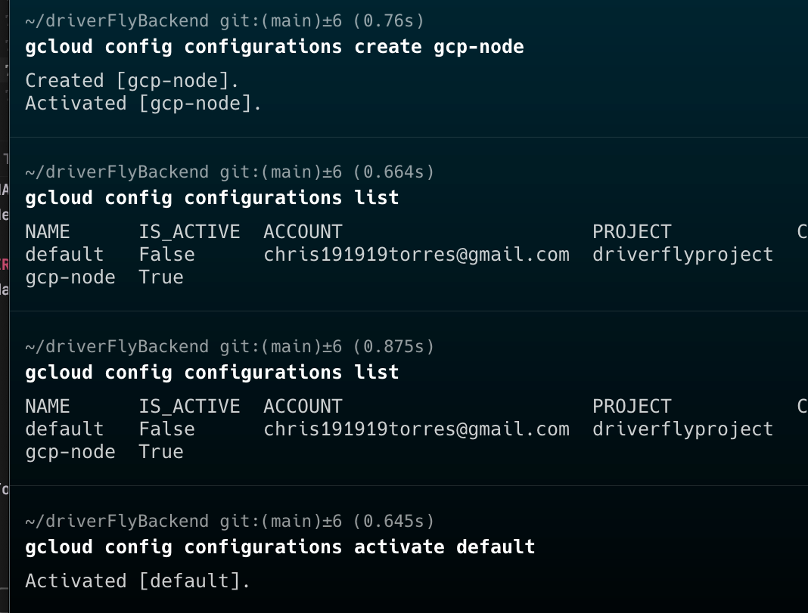

<h1 align="center">Super GraphQL Backend with the best Practices in the World</h1>

<p align="center">
  Backend prototype for any project potentially Ads Classifiers
</p>

<p align="center">
    <a href="https://github.com/AlbertHernandez/hexagonal-architecture-typescript-service-skeleton/actions/workflows/nodejs.yml?branch=main"></a>
</p>

## Table of Contents

* [Installing](#installing)
* [Building](#building)
* [Testing](#testing)
* [Linting](#linting)

## Installing

```bash
nvm install 18.0.0
nvm use
npm install npm@8.3.0 -g
npm install
```

## Building

```bash
npm run build
```

## Testing

### Jest with Testing Library

```bash
npm run test
```

## Linting

Run the linter

```bash
npm run lint
```

Fix lint issues automatically

```bash
npm run lint:fix
```



#### base repository upsertManyRecords example

<hr>

```agsl
const itemsToUpsert = [
  {
    filter: { _id: 'some-id-1' },
    update: { $set: { name: 'New Name 1', description: 'New Description 1' } }
  },
  {
    filter: { _id: 'some-id-2' },
    update: { $set: { name: 'New Name 2', description: 'New Description 2' } }
  },
  // ... more items
];
```

This is the best project in the world

gcloud config configuration list
gcloud config configurations create gcp-node
gcloud config configurations activate default


DriverFly
Para comenzar tu viaje Por favor, selecciona tu idioma
Viaja rapido, facil y comodo con DriverFly
Travel fast, easy, and comfortable with DriverFly.


